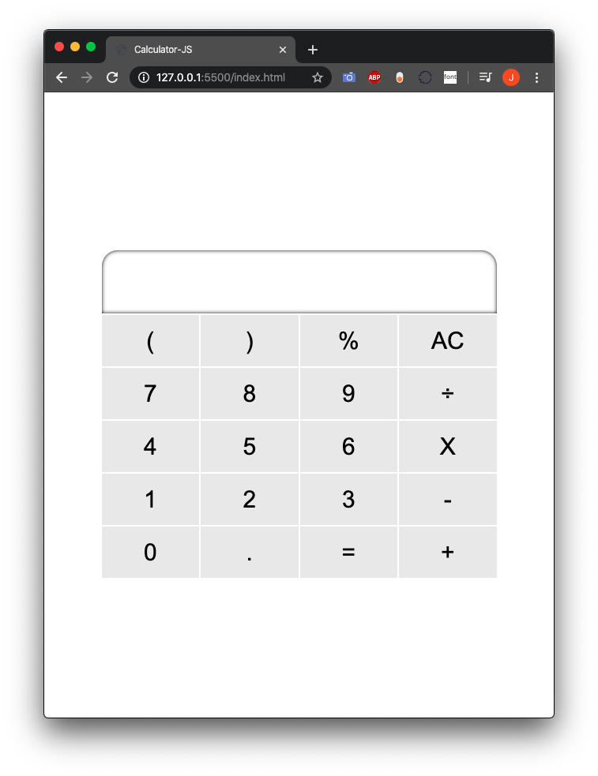
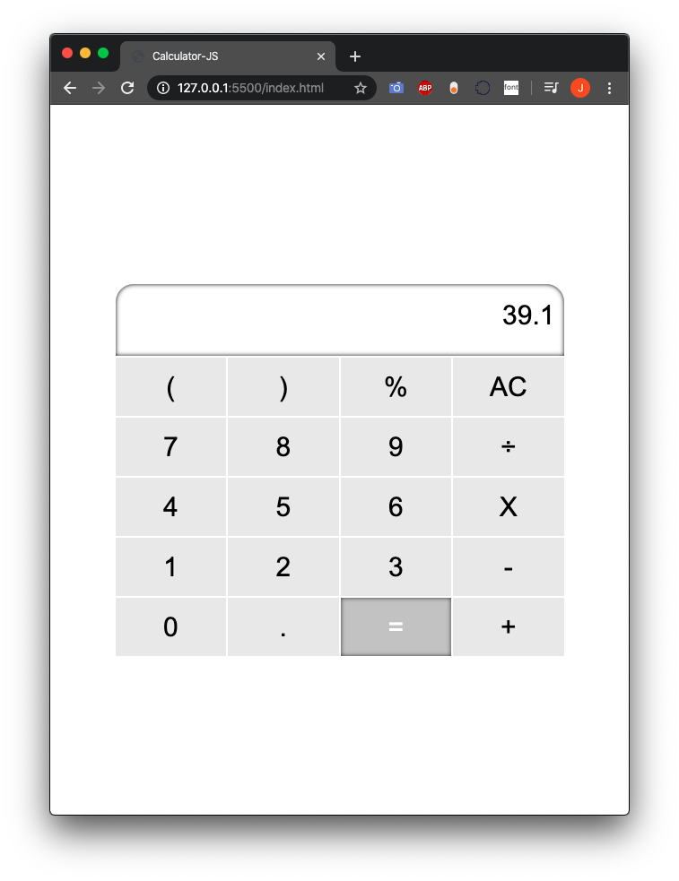

# Calculator in Native JavaScript
## Psuedocode:
* Define and create constants
    *   All numeric buttons will be an object with a value, within the object, select the corresponding element in the DOM and add an event listener
    * All non-numeric buttons will also be an object with a value, all of these objects values will be the same as their corresponding DOM elements <strong>except</strong> for Multiplication. Whose text content will be <strong>"X"</strong>, while the operator will be <strong>"*"</strong>.
* Pull necessary elements from DOM that will not be part of objects.
    *   Result element to show the result from operations
* Validate input
    * The user should not be able to chain operators. For example: ( + - % *)
* Upon clicking, the button should push it's value to an array for evaluation.
    * Upon clicking the equals(=) button, program should join items in the evaluation erray and evaluate the expression, then alter the text content of the result element with the current data. 
    * We should NOT clear the result text content, as the given logic should allow for chaining operations.

# Working Version: 

